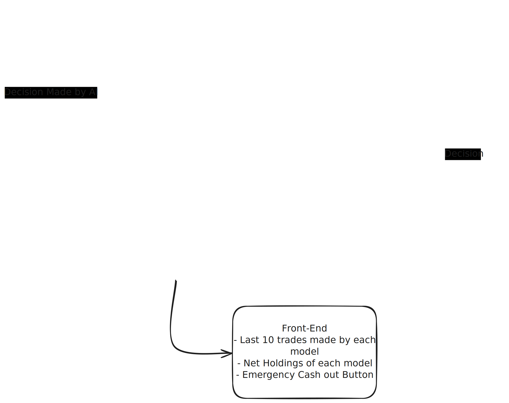

**AI-Trader is a project created to use AI models to trade crypto and try to make profits.**

### Visual Explanation

---

# Project Introduction

- Fully Autonomous Decision-Making
- Real-Time Performance Analytics 
- Intelligent Market Intelligence 

---

# Trading Environment
Each AI model starts with $30 to trade a mixture of USDT/ETH/SOL/BTC. The model can choose to distribute its cash resources anyway it sees fit WRT to the market conditions.

### When to pull the plug
If the model loses 40% of the capital, it will automatically cash out and stop trading. If the model generates returns >= 1.75x of capital, it will immediately pull the plug and book profits. 

### Models Being Used
- [claude-sonnet-4.5](https://openrouter.ai/anthropic/claude-sonnet-4.5) 
- [qwen3-max](https://openrouter.ai/qwen/qwen3-max)
- [deepseek-chat-v3.1:free](https://openrouter.ai/deepseek/deepseek-chat-v3.1:free)

---

# Front-End
- Last 10 trades made by each model
- Net Holdings of each model
- Emergency Cash Out Button