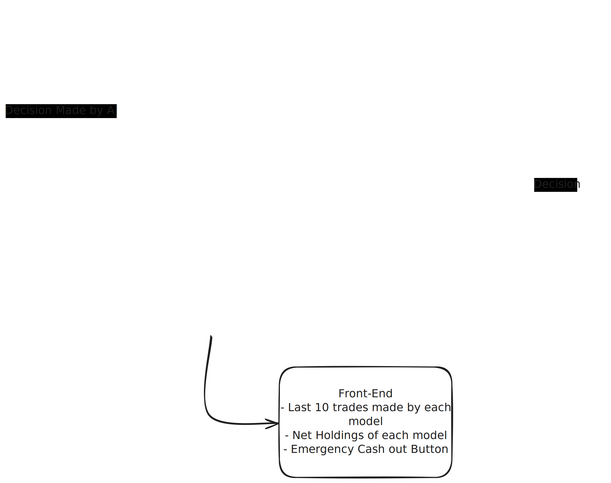

## AI Trading Simulation
A Python-based paper trading bot that uses an LLM (DeepSeek via OpenRouter) to manage a virtual crypto portfolio. The system fetches real-time market data for BTC, ETH, and SOL, feeds it to the AI, and logs the portfolio performance over time.

Note: This is a simulation using imaginary money (starting balance: $10,000 USDT). No real funds are at risk.

### Features
- Fetches 24h intraday (15m) prices for BTC, ETH, SOL using yfinance.
- Calls an OpenRouter AI model to generate JSON portfolio target allocations.
- Normalizes the AI's output to match your total portfolio value.
- Converts USD targets into crypto quantities and appends a row to data.csv.
- Optional scheduler (main_loop.py) lets the script run automatically every 16 minutes

### Visual Explanation


---

## Instalation Guide

1. Install python 3.7+.

2. Download or clone this repository:
   ```bash
   git clone https://github.com/prshv1/AI-Trading

3. Install dependencies:
    ```bash
    pip install -r requirements.txt

4. Run this program in a powershell, or a IDE like VS code. 

### Setup

1. Put your OpenRouter API key in:
    ```bash
    backend/API.txt

2. run the repeating scheduler:
    ```bash
    main_loop.py

---

## Project Structure

    AI-Trading/
    ├── backend/
    │    ├── main.py
    │    ├── requirements.txt
    │    ├── API.txt               # Your OpenRouter API key
    │    ├── system_prompt.txt     # System instructions for the model
    │    └── data.csv              # Auto-generated trade log
    └── main_loop.py

---

## Disclaimer
This project is a simulation only. It does not place real trades.
Not financial advice — use responsibly.